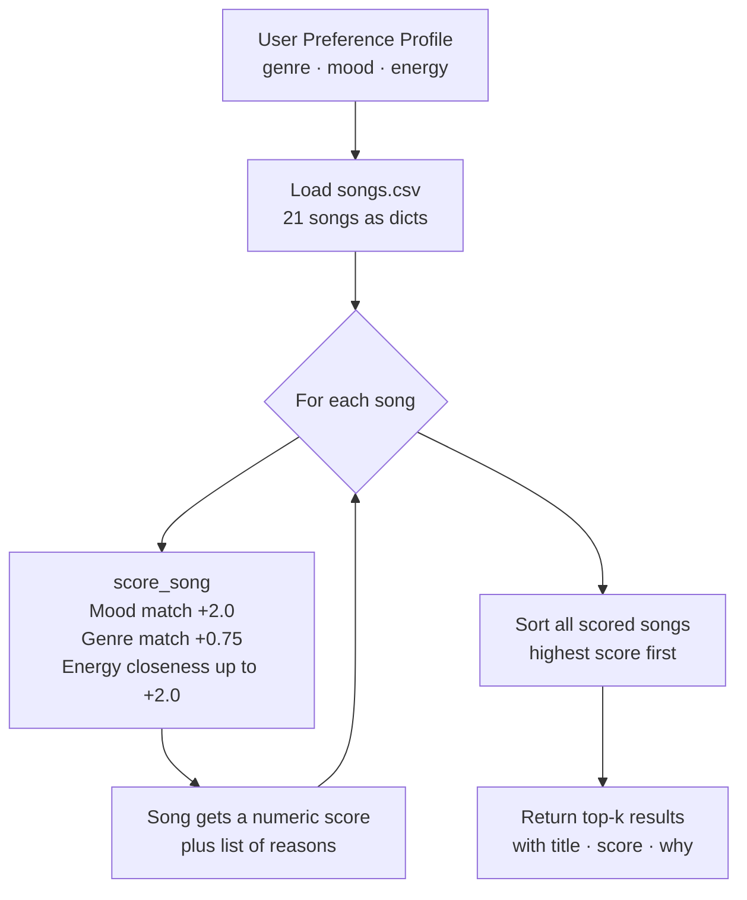

# 🎵 Music Recommender Simulation

## Project Summary

In this project you will build and explain a small music recommender system.

Your goal is to:

- Represent songs and a user "taste profile" as data
- Design a scoring rule that turns that data into recommendations
- Evaluate what your system gets right and wrong
- Reflect on how this mirrors real world AI recommenders

This project is a simplified version of how real music apps figure out what to play next. I built a scoring system that looks at a user's taste profile and compares it against a small catalog of songs, giving each song a score based on how well it matches. The top-scoring songs are what get recommended.

---

## How The System Works

Real-world recommenders like Spotify or YouTube use two main strategies: collaborative filtering (looking at what similar users listened to) and content-based filtering (looking at the actual features of a song like its tempo or mood). My version focuses on content-based filtering because it's more transparent — you can actually explain *why* a song got recommended instead of just saying "other people liked it." The system prioritizes mood and energy above everything else, because those feel like the most immediate signals for what someone actually wants to hear in a given moment. Genre matters too, but I weighted it slightly lower since people often cross genres depending on their vibe.

### Song Features

Each `Song` in the catalog stores:

- `genre` — the musical category (e.g. lofi, pop, rock, ambient, jazz, synthwave, indie pop)
- `mood` — the emotional tone (e.g. chill, happy, intense, focused, relaxed, moody)
- `energy` — a 0.0 to 1.0 score for how high-energy the track feels
- `tempo_bpm` — beats per minute
- `valence` — a 0.0 to 1.0 score for how positive or upbeat the song sounds
- `danceability` — a 0.0 to 1.0 score for how easy it is to dance to
- `acousticness` — a 0.0 to 1.0 score for how acoustic vs. electronic the song is

### UserProfile Features

Each `UserProfile` stores:

- `favorite_genre` — the genre they tend to gravitate toward
- `favorite_mood` — the mood they're looking for right now
- `target_energy` — the energy level they want (0.0 to 1.0)
- `likes_acoustic` — a true/false flag for whether they prefer acoustic over electronic sounds

### How Scoring Works

For each song, the system calculates a score out of 1.0:

- Mood match → worth **0.35** (highest weight — most immediate signal)
- Energy proximity → worth **0.30** (uses `1 - |song.energy - user.target_energy|` so closer = higher score)
- Genre match → worth **0.25** (strong identity signal but not the whole picture)
- Acoustic preference → worth **0.10** (tiebreaker based on the `likes_acoustic` flag)

All songs get scored, then sorted highest to lowest. The top `k` results (default 5) are returned as the recommendations.

---

## Data Flow



---

## Sample Output

### High-Energy Pop profile


### Chill Lofi profile


### Deep Intense Rock profile


### Adversarial — Conflicting Energy+Mood profile


### Adversarial — Unknown Genre (country) profile


### Adversarial — Extreme Low Energy profile


---

## Getting Started

### Setup

1. Create a virtual environment (optional but recommended):

   ```bash
   python -m venv .venv
   source .venv/bin/activate      # Mac or Linux
   .venv\Scripts\activate         # Windows

2. Install dependencies

```bash
pip install -r requirements.txt
```

3. Run the app:

```bash
python -m src.main
```

### Running Tests

Run the starter tests with:

```bash
pytest
```

You can add more tests in `tests/test_recommender.py`.

---

## Experiments You Tried

**Weight shift — genre halved, mood doubled:**
I started with genre at +2.0 and mood at +1.0, then swapped: mood to +2.0 and genre to +0.75. The effect was immediate — Gym Hero (pop, *intense*, energy 0.93) dropped out of the top-3 for the High-Energy Pop user because the mood mismatch ("intense" vs "happy") now cost more points than the genre match gained. This made the results feel more musically accurate.

**Energy ceiling vs energy proximity:**
The original draft awarded energy points only when the song was *above* the user's target. Switching to `1 - |diff|` (proximity) instead meant low-energy songs also score well for low-energy users — and Spacewalk Thoughts correctly rose to #1 for the Extreme Low Energy profile instead of always losing to high-energy tracks.

**Adversarial profiles:**
Three edge-case profiles were tested: a conflicting energy+mood user (lofi+chill but energy 0.9), a user whose genre (country) doesn't exist in the catalog, and a zero-energy user. Results: the conflicting profile exposes that the system can't detect contradictory preferences; the unknown-genre user is structurally penalized by 0.75 points on every song; the zero-energy profile worked without errors and returned the quietest songs correctly.

---

## Limitations and Risks

- **Catalog gap = fairness gap.** Any genre not in `songs.csv` never earns a genre bonus (+0.75). Country fans, for example, were structurally disadvantaged in every test run — their best possible score was always 0.75 lower than pop fans with otherwise identical preferences. This is a data problem that becomes a fairness problem.
- **Energy and mood are independent signals.** The system cannot detect that "chill + energy 0.9" is a contradiction. It scores mood and energy separately and adds the numbers, so a user who types conflicting preferences gets a confused playlist with no warning.
- **`likes_acoustic` was ignored in the original implementation.** A field designed into the UserProfile was never wired into the scorer, which means any preference about acoustic vs. electronic sound was silently discarded.
- **Small catalog amplifies every bias.** With only 10 (now 21) songs, one popular genre can dominate the top-5 for almost every profile. Expanding the dataset is the single highest-leverage improvement.

See `model_card.md` for a deeper analysis.

---

## Reflection

Read and complete `model_card.md`:

[**Model Card**](model_card.md)

Building this recommender made it concrete how much a scoring formula is really just a set of encoded assumptions. Giving mood the highest weight felt intuitive — of course how you feel matters most — but the moment I tested the "chill lofi at energy 0.9" profile, the system returned a mix of quiet lofi and loud workout tracks and had no way to flag the contradiction. The formula just added up numbers. That gap between what the output *looks like* (a considered recommendation with reasons) and what it actually *is* (three numbers added together) is the most important thing I took away: explainability and correctness are not the same thing.

Bias surprised me most at the data level, not the algorithm level. The scorer itself is neutral — it rewards matches. But because the starting catalog had no country, R&B, or hip-hop songs, those users were structurally penalized on every single query, not because of a bug, but because someone never added their music. Real recommenders at scale have the same problem: if the training data skews toward certain demographics or tastes, the model inherits that skew invisibly.

See [reflection.md](reflection.md) for detailed profile-by-profile comparisons.


---

## 7. `model_card_template.md`

Combines reflection and model card framing from the Module 3 guidance. :contentReference[oaicite:2]{index=2}  

```markdown
# 🎧 Model Card - Music Recommender Simulation

## 1. Model Name

Give your recommender a name, for example:

> VibeFinder 1.0

---

## 2. Intended Use

- What is this system trying to do
- Who is it for

Example:

> This model suggests 3 to 5 songs from a small catalog based on a user's preferred genre, mood, and energy level. It is for classroom exploration only, not for real users.

---

## 3. How It Works (Short Explanation)

Describe your scoring logic in plain language.

- What features of each song does it consider
- What information about the user does it use
- How does it turn those into a number

Try to avoid code in this section, treat it like an explanation to a non programmer.

---

## 4. Data

Describe your dataset.

- How many songs are in `data/songs.csv`
- Did you add or remove any songs
- What kinds of genres or moods are represented
- Whose taste does this data mostly reflect

---

## 5. Strengths

Where does your recommender work well

You can think about:
- Situations where the top results "felt right"
- Particular user profiles it served well
- Simplicity or transparency benefits

---

## 6. Limitations and Bias

Where does your recommender struggle

Some prompts:
- Does it ignore some genres or moods
- Does it treat all users as if they have the same taste shape
- Is it biased toward high energy or one genre by default
- How could this be unfair if used in a real product

---

## 7. Evaluation

How did you check your system

Examples:
- You tried multiple user profiles and wrote down whether the results matched your expectations
- You compared your simulation to what a real app like Spotify or YouTube tends to recommend
- You wrote tests for your scoring logic

You do not need a numeric metric, but if you used one, explain what it measures.

---

## 8. Future Work

If you had more time, how would you improve this recommender

Examples:

- Add support for multiple users and "group vibe" recommendations
- Balance diversity of songs instead of always picking the closest match
- Use more features, like tempo ranges or lyric themes

---

## 9. Personal Reflection

A few sentences about what you learned:

- What surprised you about how your system behaved
- How did building this change how you think about real music recommenders
- Where do you think human judgment still matters, even if the model seems "smart"

