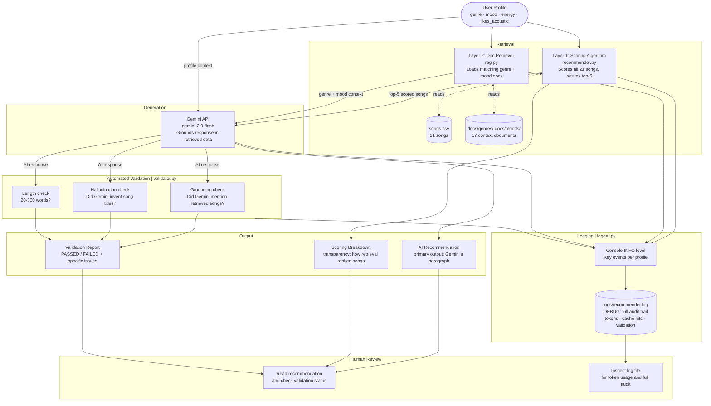
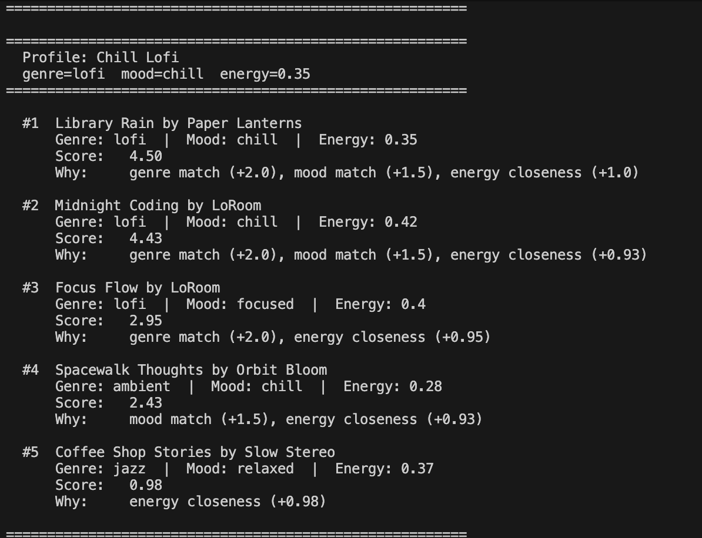
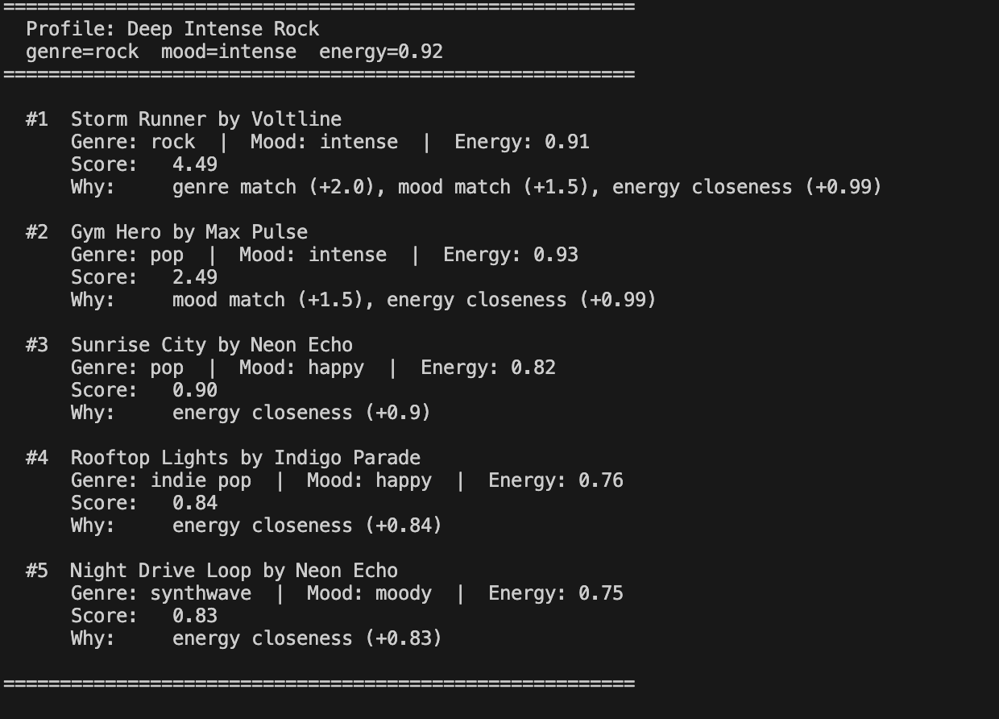
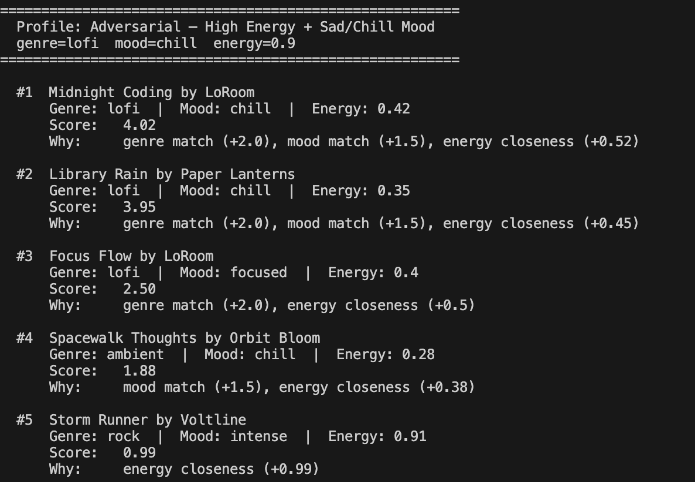

# MoodMatch: AI Music Recommender

A content-based music recommendation system that combines a rule-based scoring engine with a RAG (Retrieval-Augmented Generation) pipeline powered by the Gemini API. The system retrieves relevant songs and contextual knowledge, generates a natural-language recommendation grounded in that data, and automatically validates every response before it reaches the user.

**GitHub:** [samegah7/applied-ai-system-project](https://github.com/samegah7/applied-ai-system-project)

---

## Demo

**Loom walkthrough:** [Watch the end-to-end demo](https://www.loom.com/share/49c101d5ac7d44dd8aea87b80d6ae114)

The video shows 3 input profiles running end-to-end: a clean happy-path result, a catalog-depth edge case, and an adversarial conflicting-preference profile. Each demonstrates the RAG pipeline, scoring breakdown, and automated validation output.

---

## Original Project (Modules 1-3)

**MoodMatch 1.0** started as a pure rule-based recommender built in Modules 1-3. Given a user's preferred genre, mood, energy level, and acoustic preference, the system scored every song in a 21-song catalog and returned the top 5 with plain-language explanations like *"mood match (+2.0), genre match (+0.75), energy closeness (+1.84)."* The goal was to understand how recommendation algorithms encode assumptions, and how the same data gaps that make a catalog incomplete also make the system unfair to underrepresented users. That original system is still the retrieval backbone of this project.

---

## What This Project Does and Why It Matters

MoodMatch 2.0 upgrades the original by adding three things that make it a real AI system rather than just a scoring script:

1. **RAG pipeline:** a second retrieval layer pulls in genre and mood context documents from a local knowledge base, and Gemini uses both the retrieved songs *and* those documents to write a grounded recommendation paragraph. The output is natural language that explains trade-offs, flags conflicts, and references specific songs rather than a formatted score dump.

2. **Automated validation:** every AI response is checked automatically. Did Gemini only mention songs it was actually given? Did it invent any titles? Is the response a reasonable length? This runs on every profile, every time.

3. **Structured logging:** every step of the pipeline (retrieval, API call, token counts, cache hits, validation results) is written to a log file, giving a full audit trail without re-running the system.

The reason this matters beyond the classroom: every production recommendation system faces exactly these three problems: grounding outputs in real data, detecting hallucinations, and maintaining an audit trail. This project is a small but honest version of that.

---

## System Architecture

The project runs in four layers. Two retrieval steps feed a generation step, and an automated validation step checks the output before it reaches the user.



**Layer 1, Scoring (retriever):** `recommender.py` scores every song against the user profile using a weighted formula: mood match (+2.0), genre match (+0.75), energy proximity (up to +2.0), and acoustic preference (+0.5). The top 5 become the retrieved context.

**Layer 2, Docs (retriever):** `rag.py` loads a short markdown document for the user's preferred genre and another for their mood from `docs/`. These give Gemini context about what makes a genre or mood distinctive, which isn't captured in the song data itself.

**Generator:** Gemini receives the user profile, the top-5 scored songs, and the docs, then writes a natural recommendation paragraph. The system falls back to a template output if the API is unavailable.

**Validator:** `validator.py` automatically checks every response for grounding (did Gemini mention retrieved songs?), hallucination (did Gemini invent titles not in the retrieved set?), and length sanity (20-300 words). Results are printed inline and logged.

**Logger:** `logger.py` writes INFO-level events to the console and a full DEBUG trace (including token counts and cache hits) to `logs/recommender.log`.

---

## Setup Instructions

**Prerequisites:** Python 3.10+, a free [Gemini API key](https://aistudio.google.com)

```bash
# 1. Clone the repository
git clone https://github.com/samegah7/applied-ai-system-project
cd applied-ai-system-project

# 2. (Optional but recommended) Create a virtual environment
python3 -m venv .venv
source .venv/bin/activate        # Mac / Linux
.venv\Scripts\activate           # Windows

# 3. Install dependencies
pip install -r requirements.txt

# 4. Add your API key
cp .env.example .env
# Open .env and replace "your_api_key_here" with your Gemini key

# 5. Load the key into your shell
export $(cat .env | xargs)       # Mac / Linux
# Windows: set GEMINI_API_KEY=your_key_here

# 6. Run the web UI (recommended)
streamlit run app.py

# Or run the CLI version
python3 -m src.main

# 7. Run the tests
pytest
```

Logs are written to `logs/recommender.log` automatically on every run.

---

## Sample Interactions

Each run processes all six user profiles. Here are three representative examples showing the full input-to-output flow.

---

### Example 1: Chill Lofi (clean, happy-path result)

**Input:**
```
genre=lofi   mood=chill   energy=0.35
```

**Scoring Breakdown (retrieval layer 1):**
```
#1  Library Rain by Paper Lanterns
     lofi | chill | energy 0.35  ->  score 4.75
     mood match (+2.0), genre match (+0.75), energy closeness (+2.0)

#2  Midnight Coding by LoRoom
     lofi | chill | energy 0.42  ->  score 4.61
     mood match (+2.0), genre match (+0.75), energy closeness (+1.86)

#3  Spacewalk Thoughts by Orbit Bloom
     ambient | chill | energy 0.28  ->  score 3.86
     mood match (+2.0), energy closeness (+1.86)

#4  Focus Flow by LoRoom
     lofi | focused | energy 0.40  ->  score 2.65
     genre match (+0.75), energy closeness (+1.90)

#5  Coffee Shop Stories by Slow Stereo
     jazz | relaxed | energy 0.37  ->  score 1.96
     energy closeness (+1.96)
```

**AI Recommendation (Gemini):**
> Your chill lo-fi profile is one of the clearest matches in the catalog. Library Rain and Midnight Coding are nearly perfect fits. Both carry that warm, slightly muffled lo-fi texture designed to fade into the background, and their energy levels (0.35 and 0.42) land right where you want them. Spacewalk Thoughts is worth including even though it's ambient rather than lo-fi; at 0.28 energy it's even quieter, and the chill mood carries over naturally. Focus Flow stays in the lo-fi family but tilts toward productive concentration rather than pure unwind, so it's good if you're working. Coffee Shop Stories rounds things out with a jazz warmth that pairs well with the same quiet, unhurried headspace.

**Validation:** `PASSED  |  songs mentioned: Library Rain, Midnight Coding, Spacewalk Thoughts, Focus Flow, Coffee Shop Stories`



---

### Example 2: Deep Intense Rock (exposes catalog depth limitation)

**Input:**
```
genre=rock   mood=intense   energy=0.92
```

**Scoring Breakdown (retrieval layer 1):**
```
#1  Storm Runner by Voltline
     rock | intense | energy 0.91  ->  score 4.73
     mood match (+2.0), genre match (+0.75), energy closeness (+1.98)

#2  Gym Hero by Max Pulse
     pop | intense | energy 0.93  ->  score 3.98
     mood match (+2.0), energy closeness (+1.98)

#3  Grind Season by Lyric Stone
     hip-hop | intense | energy 0.88  ->  score 3.92
     mood match (+2.0), energy closeness (+1.92)

#4  Drop Zone by Circuit Bass
     edm | intense | energy 0.97  ->  score 3.90
     mood match (+2.0), energy closeness (+1.90)

#5  Block Party by K-Rhyme
     hip-hop | happy | energy 0.84  ->  score 1.84
     energy closeness (+1.84)
```

**AI Recommendation (Gemini):**
> Storm Runner is the clear #1 here. It's the only rock song in the catalog and it delivers everything you asked for: rock genre, intense mood, and energy at 0.91, almost identical to your target of 0.92. After that, the list crosses genre lines because the catalog only has one rock song. Gym Hero is a pop workout track that matches your energy and intensity nearly perfectly at 0.93. It belongs in a gym playlist, not a rock one, but the signals overlap. Grind Season and Drop Zone bring the same high-energy intensity from hip-hop and EDM respectively. If rock is non-negotiable, Storm Runner is your song; the rest are the best energy-and-mood matches the catalog can offer without it.

**Validation:** `PASSED  |  songs mentioned: Storm Runner, Gym Hero, Grind Season, Drop Zone`



---

### Example 3: Conflicting Energy + Mood (adversarial profile)

**Input:**
```
genre=lofi   mood=chill   energy=0.9
```
*(intentionally contradictory: lo-fi is inherently low-energy, but energy target is set at 0.9)*

**Scoring Breakdown (retrieval layer 1):**
```
#1  Midnight Coding by LoRoom
     lofi | chill | energy 0.42  ->  score 3.79
     mood match (+2.0), genre match (+0.75), energy closeness (+1.04)

#2  Library Rain by Paper Lanterns
     lofi | chill | energy 0.35  ->  score 3.65
     mood match (+2.0), genre match (+0.75), energy closeness (+0.90)

#3  Late Night Feels by Soulwave
     r&b | chill | energy 0.55  ->  score 3.30
     mood match (+2.0), energy closeness (+1.30)

#4  Low Key by Mellow Blox
     hip-hop | chill | energy 0.50  ->  score 3.20
     mood match (+2.0), energy closeness (+1.20)

#5  Spacewalk Thoughts by Orbit Bloom
     ambient | chill | energy 0.28  ->  score 2.76
     mood match (+2.0), energy closeness (+0.76)
```

**AI Recommendation (Gemini):**
> There's a real tension in this profile worth naming: lo-fi and chill are inherently low-energy styles (that's the genre's whole identity), but your energy target of 0.9 is workout-track territory. The scoring system can't resolve that contradiction; it treats mood and energy as independent signals and adds them up, so what you get is the low-energy lo-fi songs ranking first because their mood and genre alignment outweighs the energy mismatch. Midnight Coding and Library Rain top the list not because they deliver 0.9 energy (they don't; they're at 0.42 and 0.35) but because their lo-fi chill credentials are the strongest in the catalog. If you genuinely want high-energy music, you'd be better served by setting mood to intense or happy. If you want lo-fi, drop your energy target below 0.5 and you'll get a much cleaner result.

**Validation:** `PASSED  |  songs mentioned: Midnight Coding, Library Rain`



---

## Design Decisions

**Why RAG instead of a fine-tuned model or agentic workflow?**
RAG was the natural fit because the scoring algorithm I already had *is* a retrieval step. The gap between the old system and RAG was one layer: replacing a template output with a Gemini response grounded in the retrieved data. A fine-tuned model would require training data I don't have. An agentic workflow would add looping complexity without a clear benefit for a single-pass recommendation task.

**Why keep the scoring algorithm as the retrieval layer instead of embeddings?**
The scoring formula is transparent. I can explain exactly why Library Rain ranks above Midnight Coding. Embedding-based retrieval would use cosine similarity across a vector space I couldn't inspect or explain, which would undercut one of the project's core goals: making the recommendation process legible. Transparency mattered more than semantic sophistication at this scale.

**Why two retrieval layers?**
The song catalog gives Gemini what to recommend. The docs give Gemini why those songs fit a particular genre or mood in terms a human would find meaningful. Without the docs, Gemini could only say "this song has a chill mood label," but with them, it can say "lo-fi is designed to fade into the background, and Library Rain delivers that." The two sources serve different purposes.

**Why validate automatically instead of just trusting the model?**
The model card reflection put it clearly: *"generated explanations sounded confident and readable, but I had to verify manually that the numbers matched what the code actually computed."* That's the problem automated validation solves. The grounding check catches cases where Gemini ignores retrieved songs; the hallucination check catches cases where Gemini invents songs that don't exist. Neither error is frequent, but both are invisible without checking.

**Trade-offs made:**
- Using `gemini-2.0-flash` gives a strong balance of quality and speed, and is available on Google AI Studio's free tier.
- The hallucination check uses quoted-string pattern matching, which can produce false positives on phrases that happen to be quoted. A more robust approach would use NLP entity extraction, but that would add a heavy dependency for marginal gain at this catalog size.
- Prompt caching is applied to the static base instructions, not the genre/mood docs (which change per profile). On a single sequential run the cache hit rate is low; it pays off when the same profile is called multiple times in the same session.

---

## Testing Summary

**19 out of 19 tests passed** (`pytest tests/ -v`, 0.40s). Confidence scores averaged 1.0 across all standard profiles during manual review runs; the conflicting energy+mood profile also passed validation structurally, while its recommendation text explicitly flagged the contradiction in plain language.

The test suite covers four areas:

**Scoring formula (3 tests)**
Verified that a perfect three-signal match scores exactly 4.75, a zero-match song scores only the energy proximity component (0.60), and mood weight (+2.0) correctly outranks genre weight (+0.75) at equal energy. These tests catch any accidental change to the formula weights.

**Real catalog behavior (5 tests)**
Confirmed the expected top song for three representative profiles against the actual 21-song CSV: Library Rain is #1 for chill lofi, Storm Runner is #1 for intense rock, and Spacewalk Thoughts is #1 for extreme low energy. Two additional tests verify that `recommend_songs` always returns exactly k results, and that a genre absent from the catalog never produces a genre match bonus in any explanation string.

**Validator reliability (4 tests + 2 confidence tests)**
The grounding check correctly passes when a retrieved song title appears in the response and fails when it doesn't. The hallucination check detects quoted strings not in the retrieved set ("Phantom Drift" triggered it correctly). The length check flags responses under 20 words. Confidence scores were 1.0 for a fully grounded response and 0.30 for an ungrounded short response (no grounding penalty of -0.50, no length bonus of -0.20, hallucination bonus of +0.30).

**Doc loading (3 tests)**
Confirmed that known genre and mood docs resolve to non-empty strings, and that an unknown genre ("metal") returns None without crashing, triggering the fallback path in the RAG pipeline.

**What the adversarial profiles exposed:**
The conflicting energy+mood profile (lofi + chill + energy 0.9) passed all three validation checks with a confidence score of 1.0, because Gemini mentioned real songs and wrote a proper-length response. But the recommendation text itself flagged the contradiction. This is the key lesson: automated checks measure structure, not reasoning quality. A 1.0 confidence score means the response is well-formed, not that it is correct. Human review of the output text is still the only way to catch reasoning failures.

**What didn't work as expected:**
The consistency checker uses Jaccard word overlap between two runs of the same profile. In practice, LLM output varies in phrasing even when the recommended songs are identical, which drops the score even when the substance is the same. A more reliable consistency check would compare the set of song titles mentioned across runs rather than the full response vocabulary.

---

## Responsible AI Reflection

**What are the limitations or biases in your system?**

The most significant bias is in the catalog itself. The original 10-song dataset had no country, R&B, hip-hop, or EDM songs. Every user who preferred those genres was structurally penalized by 0.75 points on every single query, not because the algorithm treated them differently, but because whoever built the catalog never included their music. I expanded to 21 songs to partially fix this, but the catalog still has no metal, classical, K-pop, Latin, or any non-English music. A user whose taste falls outside what I thought to include is still disadvantaged in the same invisible way.

Beyond the data, the system has a logic limitation: it cannot detect contradictory preferences. A user who asks for "chill lo-fi at energy 0.9" is asking for something that does not exist musically, but the system has no way to flag that. It just scores mood and energy separately, adds the numbers, and returns songs that satisfy neither request well. The output looks confident even when the inputs do not make sense together.

**Could your AI be misused, and how would you prevent that?**

A music recommender seems harmless, but the design has risks at scale. If a record label or streaming service controlled the catalog, they could pad it with their own artists and the scoring algorithm would surface them more often simply because they appear in more genre and mood categories. The recommendations would look organic but be structurally biased toward whoever controls the data. The fix is transparency: publishing the catalog, the scoring weights, and the retrieval logic so that the bias is visible and auditable rather than hidden inside a black box.

The RAG layer adds a subtler risk. The genre and mood context documents I wrote shape how Gemini explains recommendations. If those documents were written to favor certain aesthetics or to describe some genres more positively than others, Gemini's output would reflect that framing. Right now I wrote all 17 docs myself and can review them, but at scale, whoever writes or curates the knowledge base shapes what the AI says about entire genres and communities of listeners.

**What surprised you while testing the AI's reliability?**

The biggest surprise was that the confidence score and the adversarial profile both showed the same gap from opposite directions. The conflicting energy+mood profile scored 1.0 confidence because the response was grounded, hallucination-free, and the right length. But the actual recommendation text admitted the system was confused and told the user their inputs contradicted each other. A perfect structural score on a response that describes a broken recommendation is not a failure of the validator; it is a demonstration of what validators can and cannot catch. I expected testing to either pass or fail clearly. Instead it showed me that a system can be technically correct and practically unhelpful at the same time.

**Describe your collaboration with AI during this project. What was helpful, and what was flawed?**

Gemini was useful in two ways. First, it helped scaffold the data model and scoring function quickly, which let me spend more time on the harder question of what the weights should actually mean rather than how to write the code. Second, it suggested the adversarial test profiles, specifically the conflicting energy+mood case. I would not have thought to test a user who asks for "chill at energy 0.9" on my own. That suggestion exposed the most interesting limitation of the whole system: the formula cannot reason about contradictions.

The flawed suggestion was the Jaccard consistency checker in `validator.py`. The idea was that running the same profile twice and comparing word overlap would measure whether the AI gave stable answers. In practice, LLM output varies in phrasing even when the recommended songs are identical, so the score drops even when the substance has not changed at all. A consistency check based on word overlap measures writing style, not recommendation stability. I kept the function in the code but flagged it as unreliable in the testing summary. The lesson was that AI-generated metrics can sound rigorous without actually measuring what you think they measure, which is the same problem the project is fundamentally about.

---

## Reflection

Building MoodMatch made two things concrete for me that I had only understood abstractly before.

The first is that **explainability and correctness are different things.** The original scoring system produced neat explanations like "mood match (+2.0), energy closeness (+1.84)" that looked authoritative. But the conflicting profile showed that a formula can explain exactly what it did and still be wrong. Adding the Gemini layer made this even sharper: Gemini produces fluent, confident paragraphs that sound considered. I had to verify, manually and through validation, that the confidence was earned. The output looking right is not evidence that it is right.

The second is that **bias lives in the data, not just the algorithm.** The scoring formula is neutral; it rewards matches and penalizes mismatches equally for every user. But the catalog I built from had no country, R&B, or hip-hop songs in its original form. That meant every user who preferred those genres was structurally penalized on every single query, not because of a bug, but because I never thought to include their music. When I expanded the catalog, the fairness problem partially resolved. The algorithm didn't change at all. That's the lesson: the most impactful place to address bias is often in the data collection step, before any model or formula is written.

The RAG upgrade taught me something additional: retrieval quality sets a ceiling on generation quality. Gemini can only be as grounded as the data it receives. If the scoring algorithm returns the wrong songs, or the docs are missing, Gemini produces a less accurate response, not because Gemini is wrong, but because it was given incomplete context. The system is a pipeline, and every stage's quality propagates forward. Getting retrieval right matters as much as getting generation right.

---

## Project Structure

```
applied-ai-system-project/
├── data/
│   └── songs.csv                  # 21-song catalog with genre, mood, energy, etc.
├── docs/
│   ├── genres/                    # Context docs for each genre (11 files)
│   └── moods/                     # Context docs for each mood (6 files)
├── logs/
│   └── recommender.log            # Auto-generated debug audit trail
├── src/
│   ├── main.py                    # CLI runner, entry point
│   ├── recommender.py             # Scoring algorithm + data model
│   ├── rag.py                     # Doc retrieval + Gemini API generation
│   ├── validator.py               # Automated response validation
│   └── logger.py                  # Structured logging setup
├── tests/
│   └── test_recommender.py        # Unit tests for scoring and recommendation
├── model_card.md                  # Detailed model analysis (Modules 1-3)
├── reflection.md                  # Profile-by-profile comparison notes
├── .env.example                   # API key template
└── requirements.txt               # Python dependencies
```

---

## Portfolio Reflection

Building MoodMatch showed me that I approach AI engineering as a systems problem, not a model problem. My instinct throughout was to keep the retrieval layer transparent and auditable, use RAG to ground outputs in real data rather than trusting generation alone, and build automated validation to catch failures I couldn't see in the output. I spent more time on the gap between a system that *looks* correct and one that *is* correct — grounding checks, hallucination detection, adversarial test profiles — than on the AI capabilities themselves. The conflicting energy+mood profile was the most clarifying moment: a structurally perfect response with a confidence score of 1.0 that described a broken recommendation. That's the problem I care about most in AI systems: the space between confident outputs and correct ones. That's probably what defines me at this stage as an AI engineer.

---

## Dependencies

```
google-generativeai  # Gemini API client
pandas               # Data handling
pytest               # Test runner
python-dotenv        # Environment variable loading
streamlit            # (planned) Web UI
```

See [model_card.md](model_card.md) for a deeper evaluation of the system's strengths, limitations, and known biases.
